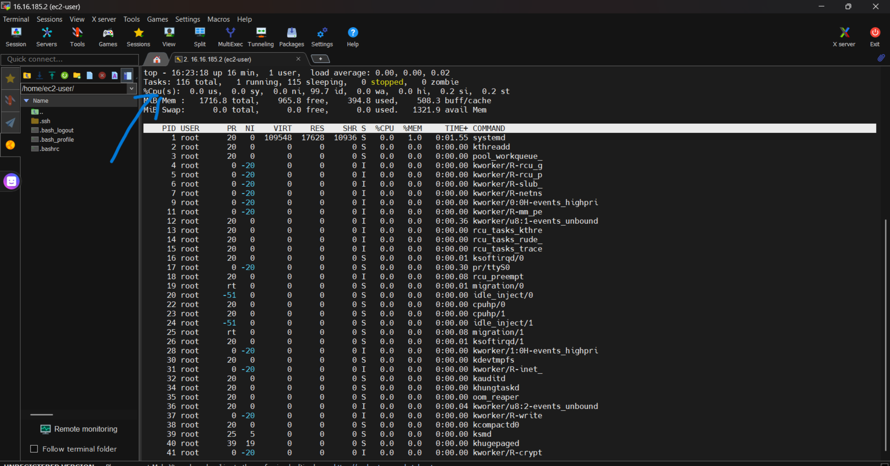

# Integrating load balancers with an auto-scaling group ensures efficient distribution of traffic while dynamically scaling server instances based on demand. Here’s a step-by-step guide to implement this setup #
## Step-by-Step Method ##

1. ## create a launch template ##
- On the aws console navigate to launch template and click on lauch template

- put the launch template name and version

- input your tag

- select you AMI (Amason Machine Image)

- select your instance type and your key pair (create a new key pair if you don't have)

- select your security group (create if you don't have)

-  click on advance details and navigate to user data  then add your bootstrap text
 here i used

    "#!/bin/bash
   yum install httpd -y
   service httpd start
   chkconfig httpd on
   hostname > /var/www/html/index.html" as my user data which install a webserver, start it , configure it and serve the hostname 
   - click on launch templates to launch your template
   
2. **Set Up the Load Balancer**:
   - on the aws console navigae to load balancer and click on create load balancer
   

   - Choose the type of load balancer (e.g., Application Load Balancer for HTTP/HTTPS traffic).
   

   - here i choosed a classic load balancer
   click on classic load balancer and click on create
   

   - Configure the load balancer with name, security groups, listeners, and routing rules. etc
     - select your name and scheme,
   for now your scheme should be internet facing
   

     - make sure it is available in all availability zone available
   

     - select your security group
  

   - set your advance health check settings
   

   - set your timeout(draining interval) in the attribute
   

   - add your tag and create your load balancer**

3. ## Set Up Your Auto Scaling Group ##
- on the aws console, navigate to the autoscaling group and click on create auto scaling group
- add the name , launch template and the version

- select all availabilty zones available and click next

- attach your load balancer by selecting from classic load balancer

- turn on elastic load balancing health check and set your Health check grace period and click on next

- set your scaling limit and set your average CPU utilization and the time for your instance warm up and click next

- add your tags and click on next

- review and create auto scaling group

## CHECKING OR TRIGGERING THE AUTOSCALING ##
To check or trigger the auto scaling, we have to simulate the CPU utilization to be greater than 70% i.e we set the CPU utilization to be 70%,
 To do the we have to loging the instance on mobaxterm application (download if you dont have)
- on the mobaxterm homepage click on session and click on SSH

- copy your instance ip and paste it on remote host, write the username as ec2-user because all instance in the aws has ec2-user as the username, then select your private key and press ok

- your instance will be logged in your mobaxterm 

- type the top command to see the CPU utilization

- use this command to simulate the CPU usage
" sudo yum install https://dl.fedoraproject.org/pub/epel/9/Everything/x86_64/Packages/e/epel-release-9-9.el9.noarch.rpm -y

sudo yum install stress -y

sudo stress --cpu 80 "
- this is the first command it finds the location of the package

- second command install the package

- third command simulate the CPU to 80%

- use the "top" command to see the CPU usage

- navigate to the AWS console, other instances will be created after some minutes

-  Access the DNS name of the load balancer to verify traffic distribution and health checks.
   by copying the DNS name and accessing it on the browser
    

